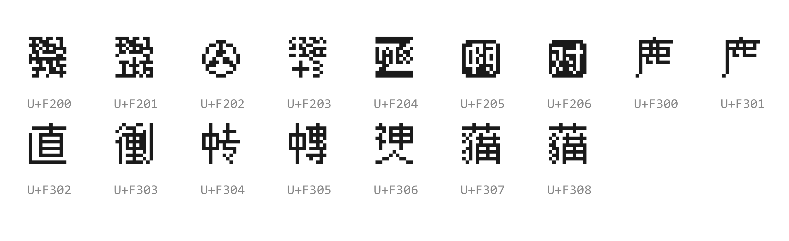

# 私用区字符一览
此处给出该字体使用的所有私用区字符，按照 Unicode 升序排序。

以下为本字体所有的私用区字符：

## F2区
- U+F200：“斑马字库”的合字，因品牌标识变更而弃用。
- U+F201：“斑马工坊”的合字，因品牌标识变更而弃用。
- U+F202：像素徽标。
- U+F203：“经验+3”的合字。
- U+F204：“Z Labs”标识。
- U+F205：“啊”的黑底方框形式。
- U+F206：“对”的黑底方框形式。

## F3区
- U+F300/U+F301：鹿字头。
- U+F302：“直”的日标字形。¹
- U+F303：⿲彳重刂，“衝”的讹字，未收入 Unicode 中。²
- U+F304：⿰中专，“中专”的合字。
- U+F305：⿰中專，“中專”的合字。
- U+F306：⿱神人，和制汉字，未收入 Unicode 中。
- U+F307：⿱艹猫，“草猫”的合字。
- U+F308：⿱艹貓，“草貓”的合字。

## 注释
1. 在 Unicode 中，陆标和日标的“直”字形未分开编码。

2. 该字见于游戏《绽放☆青春全力向前冲！》的繁体中文标题中：

